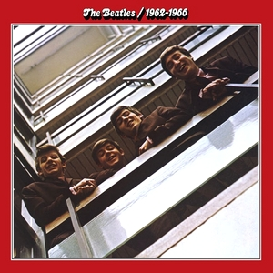
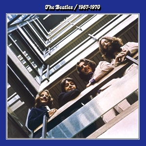
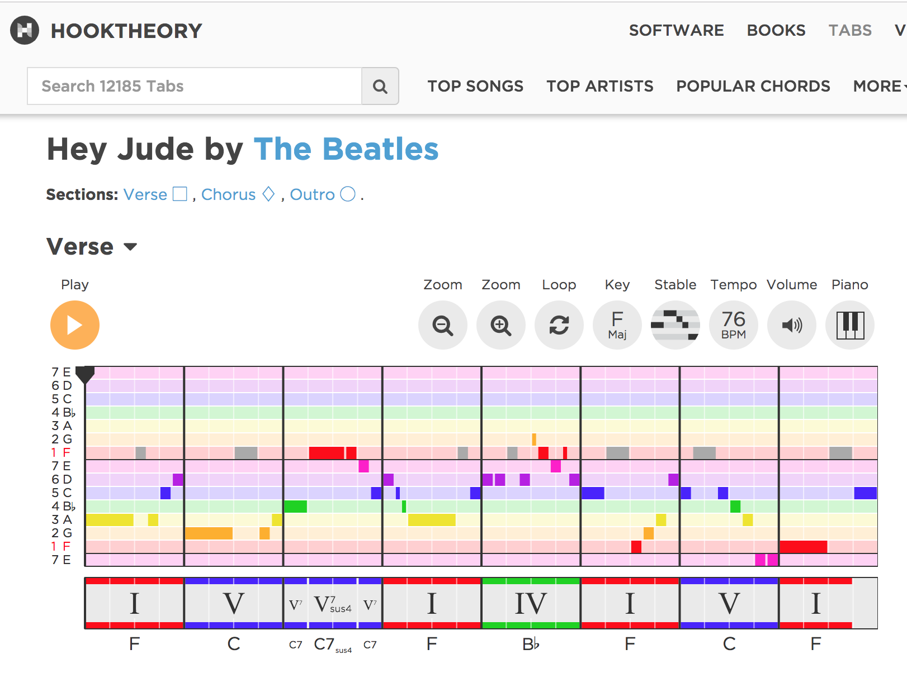

```{r setup, include=FALSE}
knitr::opts_chunk$set(echo = TRUE)
require(knitr)
require(tidyverse)
require(kableExtra)
require(tm)
require(tidytext)
require(tidyverse)
source('src/source.R')

#Read In Data
beatles <- read.csv( 'data/output/beatles_full.csv', stringsAsFactors = F)

#Relevel album_name factor to be in chronological order
album_chron_levels <- beatles %>% 
  group_by(album_name, album_release_date) %>% 
  count %>% 
  arrange(album_release_date) %>% 
  drop_na %>% 
  pull(album_name) 
beatles <- beatles %>% 
  mutate(album_name = factor(album_name, levels =album_chron_levels)
)


#Drop 'Besame Mucho' because it is a cover song 
beatles <- beatles %>%  filter(song != 'Besame Mucho')

```


#### Research Question
How did chord progressions in Beatles songs evolve over time? 

#### Research Objective
Using ngrams, build a model to classify Beatles as an 'early' or 'late' song. 

#### Why this matters?  (Or at the very least, why this matters to me?)
As I have worked on this project, I have noticed that it very difficult to describe its relevance because music is a very abstract thing.  If this were a research project on the use of color in paintings, for example, it would be more accessible because although many people may not have a deep understanding of color theory, but most have at least an understanding of color (i.e. they know what 'blue', 'red', and 'yellow' mean).  However, most people would probably not understand the meaning of a  'I-IV-V' or 'ii-V-I' chord progression unless they have taken a class in music theory. 

Consequently, my intended audience would be someone who already has a background in music theory and would be able to understand a basic chord progression written in roman numerical analysis.  My belief is that understanding how chord progressions in the music of Beatles changed over time will help musical historians to understand the compositional structure of their songs.  In addition, it will help musicians understand unique qualities in Beatles music that may inform their own compositions. The ultimate goal would be to present the findings in terms of chord sequences associated with each musical phase.  These findings should be relevant to a musician or music theorist even if they do not understand underlying statistical and machine learning methods that were used to discover these chord sequences. 

#### Early Beatles vs. Later Beatles
```{r  out.width = "50%", echo = F}
 
 
```

When I was growing up, I was always fascinated by the two images from the Beatles first two compilation albums released after their break up.  The red album contains songs from 1962 to 1966 and the blue album contains songs from 1967 to 1970 (The actual cutoff date  is June 21, 1966).  The album covers show the fab four in the same location, but with wildly different hairstyles and clothing. The two albums contrast their early clean cut mop-top image  with their later long-haired, psychodelic stlye.  My goal with this project is to examine the stylistic progression of the Beatles by examining their most common chord progression during each of these phases.  In other words, I want to classify songs based on their chord progression as either belonging the 'red album' (early phase) or the 'blue album' (later phase).


#### Literature Review
I found two particularly relevant articles.  Douglas J. Mason, a Ph. D. student at Harvard, used hierarchical clustering techniques to examine chords in Beatles songs (2012).  He noticed certain clusters of songs based on the usage of 'borrowed chords'.  Borrowed chords are chords that do not belong to the key of the song but are 'borrowed' from a different scale.  The author noticed that these clusters generally contained songs that were from different albums.  However, the majority of the songs, which were taken from *Rolling Stone's* list of the Top 100 Beatles songs, were from their later period (1967 to 1970).

In another study, Pérez-Sancho et. al employed text analysis techiniques such as bigrams and trigrams to build models for classifying musical pieces according to genre (2009).  Using this method, they were able to classify songs according to genre with 80% accuracy.  However, they did not achieve the same level of accuracy when classifying music according to sub-genres (e.g. classifying different types of music within the rock genre).

#### Data Collection 
To build a dataset of Beatles chord progressions, I created a webcrawler to scrape chords from Hooktheory.com.  Hooktheory contains over 12,000 songs, which includ a large number of Beatles songs. Each song is  divided according to different sections (e.g. Verse, Chorus, etc.).  The site does not contain the entire song but rather just the repeating pattern for each section.  Below, you can see the chords from the  verse from 'Hey Jude', which are repeated throughout the song. I was able to scrape the 'letter' chords but not the roman numerical analysis.  However, using the song key, which I also scraped from the site, I was able to build a function that converted the 'letter' chords into roman numerals.  As I will explain in the next session, the roman numerals represent each chord's position in a given key. 
```{r out.width = "100%", echo = F}
 

```


#### Roman Numerical Analysis
You may notice in the image above, that the chords are represented by both letters and roman numerals.  The roman numerals represent the chord used relative to each key.  'Hey Jude' is written in the key of F major, so the F major chord can be represented with a 'I'.  Notice that when referring to major chords, it is often common practice to simply write a capital letter without writing 'major' (e.g. 'F' means 'F major' and 'C means 'C major').  

The next chord is a C.  The key of F contains the notes F, G, A, Bb, C, D, and E.  Notice that 'C' is the fifth note of the F scale.  Consequently, we can represent C with a 'V'.

Using roman numerical analysis, we can compare equivalent chord progressions in different keys.  For example, let's say we want to write a song in 'G major'.  Then a G major chord  would now be represented as 'I' and 'D major' would be represented as 'V'.  This is because D would be the fifth chord in the key of G (G, A, B, C, D, E, and F#)

```{r Roman Numerical Analysis}

key <- c('Fmaj', 'Gmaj')
roman <- c('I', 'ii', 'iii', 'IV', 'V or V7', 'vi', 'viio')
chords_F <- c('F', 'gm', 'am', 'Bb', 'C or C7', 'dm', 'eo')
chords_G <- c('G', 'am', 'bm', 'C', 'D or D7', 'em', 'f#o')

key <- data.frame(key, rbind(t(chords_F), t(chords_G)) )
names(key) <- c('key', roman)
key %>% 
  kable %>% 
  kable_styling
```
In the table above, you can see the chords found in G major and Fmajor.  Each column name represents the roman numeral that would be assigned to that chord based on the key.  Minor chords are generally represented by lower case letters and, in this case, also are followed by a lowercase 'm' (e.g. 'gm' represents g minor).  The circle in 'eo' and 'f#o' represent diminished chords, but they are much less common in rock music than major, minor and seventh chords.

It should be noted that this is a very basic introduction to music theory. You can read more about music theory in the music_theory.pdf file in the github repository.  

#### Songs Available on Hooktheory

```{r}
beatles %>% 
  count(phase, song) %>% 
  count(phase)
```


#### Songs Available on Hooktheory By Phase
```{r Barplot: Songs Available on Hooktheory By Phase}
beatles %>% 
  count(phase, song) %>% 
  count(phase) %>% 
  drop_na(phase) %>% 
  ggplot(aes(x = phase, y = nn, fill = phase)) +
  geom_col() +
  scale_fill_manual(values = c('red', 'blue' )) +
  ylab('Number of Songs') +
  ggtitle('Beatles Songs Available on Hook Theory') +
  scale_y_continuous(limits = c(0, 65), expand = c(0, 0)) +
  my_theme  

```

There were 37 songs available from the early phase and 63 songs from the later phase.  There were a total of 100 songs, which is the same as the sample size from the Beatles Genome {roject. 

#### Available Hooktheory Songs by Album
```{r Barplot: Available Hooktheory Songs by Album}
beatles %>% 
  count(album_name, year, song, phase) %>% 
  count(album_name, year, phase) %>% 
  drop_na(album_name) %>% 
  ggplot(aes(x = album_name, y = nn, fill = phase)) +
  geom_col() +
  scale_fill_manual(values = c('red', 'blue' )) +
  scale_y_continuous(expand = c(0,0), limits = c(0,20)) +
  xlab('Album Name') +
  ylab('Number of Songs') +
  geom_hline(yintercept = 12, lty = 'dashed', color = 'orange') +
  ggtitle('Beatles Songs Available on Hook Theory by Album') +
  my_theme_tilt
```
Songs from the *White Album* appear to be overrepresented.  However, the *White Album* contained 30 tracks, which is an unusually high number for a Beatles Album.  Songs from *Yellow Submarine*, *Let It Be* and many of the earlier albums appear to be underrepresented.  I added an orange dashed line at y=12 to represent the typical number of songs per album in order to portray a sense of how many songs are missing from each album.  


```{r Singles}
beatles %>%  
  filter(is.na(album_name)) %>% 
  distinct(artist, song, year, phase) %>% 
  arrange(year)

```
There were seven songs in the dataset that were singles and not associated with any album.  I searched online to find out the year that they were released, and I coded the phase accordingly. 


#### Mean Number of Unique Chords
```{r Line Graph: Mean Number of Unique Chords Per Song by Year}
beatles %>%
  group_by(song, year) %>% 
  summarize(num_chords = sum_chords_unique(chords)) %>% 
  group_by(year) %>% 
  summarize(mean_num_chords = mean(num_chords)) %>% 
  ggplot(aes(x = year, y = mean_num_chords)) +
  geom_line() +
  geom_point() +
  geom_vline(xintercept = 1966, lty = 'dashed', color = 'blue') +
  scale_x_discrete( limits =  1963:1970, breaks = 1963:1970) +
  scale_y_continuous(limits = c(0, 12), breaks = 0:12) +
  ggtitle('Mean Number of Unique Chords Per Song by Year') +
  xlab('Year') +
  ylab('Mean Chord Number') +
  my_theme

```

#### Mean Number of Unique Chords Per Song by Album
```{r Bar Plot: Mean Number of Unique Chords Per Song by Album}
beatles %>%
  group_by(song, album_name, phase) %>% 
  summarize(num_chords = sum_chords_unique(chords)) %>% 
  group_by(album_name, phase) %>% 
  summarize(mean_num_chords = mean(num_chords)) %>% 
  drop_na(album_name) %>% 
  ggplot(aes(x = album_name, y = mean_num_chords, fill = phase)) +
  geom_col() +
  ggtitle('Average Number of Chords per Song by Album') +
  xlab('Album') +
  ylab('Average Number of Chords') +
  scale_y_continuous(expand = c(0, 0), limits = c(0, 10), breaks = seq(0, 10, 2)) +
  my_theme_tilt

```

*Revolver* and *Let it Be* seem to not follow the generally positive trend in the average number of chords per song over time. 

#### Line Graph: Mean Number of Unique Chords Per Song by Year (Grouped by Phase)
```{r pressure, echo=FALSE}
beatles %>%
  group_by(song, year, phase) %>% 
  summarize(num_chords = sum_chords_unique(chords)) %>% 
  group_by(year, phase) %>% 
  summarize(mean_num_chords = mean(num_chords)) %>% 
  ggplot(aes(x = year, y = mean_num_chords, color = phase, group = phase)) +
  geom_vline(xintercept = 1966, lty = 'dashed', color = 'blue') +
  geom_line() +
  geom_point(aes(group = phase, color = phase)) +
  scale_x_discrete( limits =  1963:1970, breaks = 1963:1970) +
  scale_y_continuous(limits = c(0, 12), breaks = seq(0, 12, 2)) +
  ggtitle('Mean Number of Unique Chords Per Song by Year (Grouped by Phase)') +
  xlab('Year') +
  ylab('Mean Chord Number') +
  my_theme

```


#### Table: Album/Single by Year
```{r Table: Album/Single by Year}
beatles %>%  
  mutate(name  = if_else(is.na(album_name)==T, song, as.character(album_name)),
         album_or_single = if_else(is.na(album_name)==T, 'Single', 'Album')) %>% 
  distinct(name, year, album_or_single, phase) %>% 
  arrange(year, phase) %>% 
  kable %>% 
  kable_styling

```
*Revolver* and *Let It Be* seem to not follow the general linear trend.   It is worth noting that the 'early' phase song in 1966 is 'Paperback Writer', which has only two chords listed on hooktheory. 


#### Borrowed Chords: *Their chords were outrageous, just outrageous* 
The Beatles often experimented with unusual chords in their songs.  In fact, Bob Dylan is quoted as saying that 'their chords were outrageous, just outrageous and their harmonies made it all valid' (Tomasky 2014).  While examining the dataset, I, like Bob Dylan, noticed that the Beatles used a lot of **borrowed chords**.  Borrowed chords are chords that are 'borrowed' from another key.  It is important to distinguish borrowed chords form modulation.   In modulation, the tone or key of the song actually changes, but with borrowed chords the key of the song remains the same despite the fact that the chord is not found in the original key.  Borrowed chords are also know as passing chords, which might be a useful way of thinking about them because they essentially 'pass' before the song has a chance to actually change key.  A good example is the verse 'For No One', which you can explore by clicking the link **[here](https://www.hooktheory.com/theorytab/view/the-beatles/for-no-one)**.  Click 'play', and listen carefully.  You will notice that the *Amaj*, sounds a little bit different from the other chords.  That is because all the other chords belong to *B major*, which is the key of the song.  However, *A major* is not found in the key of *B Major* and is actually borrowed from *B minor*.  However, in my opinion, the surprising presence of this chord adds tension to the song, which mirrors the tension of its lyrical theme of a relationship that is close to its end. 
```{r Calculate Borrowed Chords}

#Calculate Borrowed Chords and Number of Chords in Each Song
beatles$roman <- as.character(beatles$roman)
beatles$borrowed_pct <- beatles$roman %>% 
                      lapply(borrow_chord_pct) %>%  unlist
beatles$num_chords <- beatles$roman %>% 
                              lapply(sum_chords) %>%  unlist

#### Plot Percent Borrowed Chords ####
pct_borrowed_chord_tab <-beatles %>% 
                              mutate(wt_pct_borrowed =  borrowed_pct*num_chords  )%>% 
                              drop_na(album_name) %>% 
                              group_by(album_name, phase) %>% 
                              summarize(pct_borrowed_sum = sum(wt_pct_borrowed) / sum(num_chords))
pct_borrowed_chord_tab  %>% 
  kable %>% 
  kable_styling
```


**Important Point**
I think the particular quality the 'Amajor' chord evokes in the verse of 'For No One' is a perfect example of how the mathematical structure of a song can reveal a particular artistic/emotional quality.  I think that this example provides a much better explanation of the artistic relevance of the statistical analysis of chord progressions than anything I could possibly write. 

#####  Proportion of Borrowed Chords By Album 
```{r Barplot: Proportion of Borrowed Chords By Album}
pct_borrowed_chord_tab %>% 
  ggplot(aes(x = album_name, y= pct_borrowed_sum, fill = phase)) + 
  geom_col() +
  scale_y_continuous(expand = c(0,0), 
                     limits = c(0, 0.5), 
                     breaks = seq(0, 0.4, .1)) +
  ggtitle('Proportion of Borrowed Chords By Album') +
  xlab('Album Name') +
  ylab('Proportion') +
  my_theme_tilt 
```
In general, songs from albums in the later phase tend to have a higher proportion of borrowed chords.  However, *Rubber Soul* has a high proportion of borrowed chords despite being classified in the early phase (although it is the last album before the cutoff) and *Let It Be* has a low proportion of borrowed chords despite being released in 1970.  These trends mirror the trends from average number of chords per song plots.

### Bigrams
```{r Construct Bigrams}

#Split each song into a separate dataframe 
#Bind Songs into data.frame
#This creates a data.frame where each row is one song
#where roman represents all the chords in the song
l <- beatles %>%  
          split(f = beatles$song) %>% 
          lapply(function(x) data.frame(artist = unique(x$artist), 
                                song = unique(x$song), 
                                roman = paste(x$roman, collapse = '-')))
df <- suppressWarnings(bind_rows(l)) 

#Deal with borrow chords (slashes will be considered separate ngrams)
#Then Create bigrams
bigrams <- df %>%  
      mutate(roman = str_replace_all(roman, '-', ' ')) %>% 
      mutate(roman = str_remove_all(roman, '\\(')) %>% 
      mutate(roman = str_remove_all(roman, '\\)')) %>% 
      mutate(roman = str_replace_all(roman, '/', 'BORROWED')) %>% 
      unnest_tokens(bigram, roman, token = 'ngrams', n = 2,
                    to_lower = F) %>%  
      count(song, bigram) %>% 
      mutate(bigram = if_else(grepl('\\s+[a-z]+BORROWED', bigram),
                              paste0(bigram, ')'), bigram),
             bigram = if_else(grepl('\\s+[A-Z]+BORROWED', bigram),
                              paste0(bigram, ')'), bigram),
            bigram = if_else(grepl('BORROWED+[a-z]+\\s', bigram), 
                             str_replace(bigram, ' ', '\\) '), bigram),
              bigram = if_else(grepl('BORROWED+[A-Z]+\\s', bigram), 
                             str_replace(bigram, ' ', '\\) '), bigram),
             bigram = str_replace_all(bigram, 'BORROWED', '/\\('),
             bigram = str_replace_all(bigram, '\\s', '-')) %>% 
      select(song, bigram, n) 

#Remove bigrams with same chords
bigrams <- bigrams %>% 
              separate(bigram, c('chord_1', 'chord_2'), sep = "-") %>% 
              filter(chord_1 != chord_2) %>% 
              unite(bigram, chord_1, chord_2, sep = "-")

#Get Song Info
song_info <-beatles %>% 
              select(song, album_name, year, phase)

bigram_info <- bigrams %>% 
                   left_join(song_info, by = 'song')
```

#### Top 10 Bigrams: Early Beatles
```{r Top 10 Bigrams: Early Beatles}
early_bigrams_top_10 <- bigram_info %>% 
                    filter(phase == 'Early') %>% 
                    group_by(phase, bigram) %>% 
                    summarize(n = sum(n)) %>% 
                    arrange(desc(n)) %>% 
                    slice(1:10)
early_bigrams_top_10 

```


### Top 10 Bigrams: Late Beatles
```{r Top 10 Bigrams: Late Beatles}

late_bigrams_top_10 <- bigram_info %>% 
                        filter(phase == 'Late') %>% 
                        group_by(phase, bigram) %>% 
                        summarize(n = sum(n)) %>% 
                        arrange(desc(n)) %>% 
                        slice(1:10)

late_bigrams_top_10 

```


###Trigrams
```{r Construct Trigrams}

#Remove Duplicate chords in sequence 
df$roman <- df$roman %>%  
                sapply(remove_duplicates)

#Deal with borrow chords (slashes will be considered separate ngrams)
#Then Create trigrams
trigrams <- df %>%  
      mutate(roman = str_replace_all(roman, '-', ' ')) %>% 
      mutate(roman = str_remove_all(roman, '\\(')) %>% 
      mutate(roman = str_remove_all(roman, '\\)')) %>% 
      mutate(roman = str_replace_all(roman, '/', 'BORROWED')) %>% 
      unnest_tokens(trigram, roman, token = 'ngrams', n = 3,
                    to_lower = F) %>%  
      count(song, trigram) %>% 
      select(song, trigram, n) 

trigrams$trigram <- trigrams$trigram %>%  
                      str_split(pattern = '\\s', simplify = F) %>% 
                      lapply(function(x) paste0(x, ifelse(grepl('BORROWED',x), ')', ''))) %>% 
                      lapply(function(x) x %>%  str_replace(pattern = 'BORROWED', '/\\(')) %>% 
                      lapply(function(x) paste(x, collapse = '-')) %>% 
                      unlist 

#Get Song Info
song_info <-beatles %>% 
              select(song, album_name, year, phase)

trigram_info <- trigrams %>% 
                   left_join(song_info, by = 'song')
```


### Top 10 Trigrams: Early Beatles
```{r Top 10 Trigrams: Early Beatles}
early_trigrams_top_10 <- trigram_info %>% 
                    filter(phase == 'Early') %>% 
                    group_by(phase, trigram) %>% 
                    summarize(n = sum(n)) %>% 
                    arrange(desc(n)) %>% 
                    slice(1:10)
early_trigrams_top_10 %>% 
  kable %>% 
  kable_styling

```


###Top 10 Trigrams: Late Beatles
```{r Top 10 Trigrams: Late Beatles}

late_trigrams_top_10 <- trigram_info %>% 
                    filter(phase == 'Late') %>% 
                    group_by(phase, trigram) %>% 
                    summarize(n = sum(n)) %>% 
                    arrange(desc(n)) %>% 
                    slice(1:10)
late_trigrams_top_10 %>% 
  kable %>% 
  kable_styling

```


### Construct Bigrams with Features
```{r Construct Bigrams with Features}
#Split each song into a separate dataframe 
#Bind Songs into data.frame
#This creates a data.frame where each row is one song
#where roman_features represents all the chords in the song
l <- beatles %>%  
          split(f = beatles$song) %>% 
          lapply(function(x) data.frame(artist = unique(x$artist), 
                                song = unique(x$song), 
                                roman_features= paste(x$roman_features, collapse = '-')))
df_features <- suppressWarnings(bind_rows(l)) 

#Deal with borrow chords (slashes will be considered separate ngrams)
#Then Create bigrams
bigrams_features <- df_features %>%  
      mutate(roman_features = str_replace_all(roman_features, '-', ' ')) %>% 
      mutate(roman_features = str_remove_all(roman_features, '\\(')) %>% 
      mutate(roman_features = str_remove_all(roman_features, '\\)')) %>% 
      mutate(roman_features = str_replace_all(roman_features, '/', 'BORROWED')) %>% 
      unnest_tokens(bigram, roman_features, token = 'ngrams', n = 2,
                    to_lower = F) %>%  
      count(song, bigram) %>% 
      mutate(bigram = if_else(grepl('\\s+[a-z]+BORROWED', bigram),
                              paste0(bigram, ')'), bigram),
             bigram = if_else(grepl('\\s+[A-Z]+BORROWED', bigram),
                              paste0(bigram, ')'), bigram),
            bigram = if_else(grepl('BORROWED+[a-z]+\\s', bigram), 
                             str_replace(bigram, ' ', '\\) '), bigram),
              bigram = if_else(grepl('BORROWED+[A-Z]+\\s', bigram), 
                             str_replace(bigram, ' ', '\\) '), bigram),
             bigram = str_replace_all(bigram, 'BORROWED', '/\\('),
             bigram = str_replace_all(bigram, '\\s', '-')) %>% 
      select(song, bigram, n) 

#Remove bigrams with same chords
bigrams_features  <- bigrams_features  %>% 
              separate(bigram, c('chord_1', 'chord_2'), sep = "-") %>% 
              filter(chord_1 != chord_2) %>% 
              unite(bigram, chord_1, chord_2, sep = "-")

#Get Song Info
song_info <-beatles %>% 
              select(song, album_name, year, phase)

bigrams_features_info <- bigrams_features %>% 
                   left_join(song_info, by = 'song')

```


#### Top 10 Bigrams (with FEATURES) : Early Beatles
```{r Top 10 Bigrams (with FEATURES): Early Beatles}
early_bigrams_features_top_10 <- bigrams_features_info %>% 
                    filter(phase == 'Early') %>% 
                    group_by(phase, bigram) %>% 
                    summarize(n = sum(n)) %>% 
                    arrange(desc(n)) %>% 
                    slice(1:10)
early_bigrams_features_top_10 %>% 
  kable %>% 
  kable_styling


```


#### Top 10 Bigrams (with FEATURES) : Late Beatles
```{r Top 10 Bigrams (with FEATURES): Late Beatles}
late_bigrams_features_top_10 <- bigrams_features_info %>% 
                    filter(phase == 'Late') %>% 
                    group_by(phase, bigram) %>% 
                    summarize(n = sum(n)) %>% 
                    arrange(desc(n)) %>% 
                    slice(1:10)
late_bigrams_features_top_10 %>% 
  kable %>% 
  kable_styling

```

In both cases, there are some dominant 7 in the top 10, but not any other chords beyond major and minor chords. 


#### Construct Trigrams with FEATURES
```{r Construct Trigrams with FEATURES}

#Remove Duplicate chords in sequence 
df_features$roman_features <- df_features$roman_features %>%  
                                            sapply(remove_duplicates)

#Deal with borrow chords (slashes will be considered separate ngrams)
#Then Create trigrams
trigrams_features <- df_features %>%  
      mutate(roman_features = str_replace_all(roman_features, '-', ' ')) %>% 
      mutate(roman_features = str_remove_all(roman_features, '\\(')) %>% 
      mutate(roman_features = str_remove_all(roman_features, '\\)')) %>% 
      mutate(roman_features = str_replace_all(roman_features, '/', 'BORROWED')) %>% 
      unnest_tokens(trigram, roman_features, token = 'ngrams', n = 3,
                    to_lower = F) %>%  
      count(song, trigram) %>% 
      select(song, trigram, n) 

trigrams_features$trigram <-trigrams_features$trigram %>%  
                      str_split(pattern = '\\s', simplify = F) %>% 
                      lapply(function(x) paste0(x, ifelse(grepl('BORROWED',x), ')', ''))) %>% 
                      lapply(function(x) x %>%  str_replace(pattern = 'BORROWED', '/\\(')) %>% 
                      lapply(function(x) paste(x, collapse = '-')) %>% 
                      unlist 

#Get Song Info
song_info <-beatles %>% 
              select(song, album_name, year, phase)

trigrams_features_info <- trigrams_features %>% 
                   left_join(song_info, by = 'song')
```


### Top 10 Trigrams with FEATURES: Early Beatles
```{r Top 10 Trigrams with FEATURES: Early Beatles}
early_trigrams_features_top_10 <- trigrams_features_info %>% 
                    filter(phase == 'Early') %>% 
                    group_by(phase, trigram) %>% 
                    summarize(n = sum(n)) %>% 
                    arrange(desc(n)) %>% 
                    slice(1:10)
early_trigrams_features_top_10  %>% 
  kable %>% 
  kable_styling

```


### Top 10 Trigrams with FEATURES: Late Beatles
```{r Top 10 Trigrams with FEATURES: Late Beatles}
late_trigrams_features_top_10 <- trigrams_features_info %>% 
                                      filter(phase == 'Late') %>% 
                                      group_by(phase, trigram) %>% 
                                      summarize(n = sum(n)) %>% 
                                      arrange(desc(n)) %>% 
                                      slice(1:10)
late_trigrams_features_top_10  %>% 
  kable %>% 
  kable_styling

```


#### Document Term Matrix: Bigrams 
```{r Document Term Matrix (Bigrams), message = F}
top_bigrams <- bigrams  %>%
                      count(bigram, sort = T) %>%
                      slice(1:100) %>%
                      select(bigram)
         
#Create document-term matrix   
dtm <- bigrams %>% 
          inner_join(top_bigrams) %>% 
          cast_dtm(document = song, term = bigram,  value = n, weighting = tm::weightTfIdf)
dtm_tibble <-  cbind(dtm$dimnames$Docs, as.matrix(dtm)) %>% as.tibble()

#Convert td*idf to numeric 
dtm_tibble <- dtm_tibble %>% 
                mutate_if(grepl('-', names(dtm_tibble)), as.numeric)


#Rename first variable as song; join dtm with other data
names(dtm_tibble)[grep('V1', names(dtm_tibble))] <- 'song'
dtm_song_info <- dtm_tibble  %>% 
                    left_join(song_info)

#Display subset of columns from document-term matrix
dtm_song_info[1:10, 1:8] %>%
    mutate_if(is.numeric, function(.) round(., 2)) %>% 
    kable %>% 
    kable_styling 
   
```

#### Document Term Matrix: Trigrams 
```{r Document Term Matrix: Trigrams, message = F}
top_trigrams <- trigrams  %>%
                      count(trigram, sort = T) %>%
                      slice(1:100) %>%
                      select(trigram)
         
#Create document-term matrix   
dtm <- trigrams %>% 
          inner_join(top_trigrams) %>% 
          cast_dtm(document = song, term = trigram,  value = n, weighting = tm::weightTfIdf)
dtm_tibble <-  cbind(dtm$dimnames$Docs, as.matrix(dtm)) %>% as.tibble()

#Convert td*idf to numeric 
dtm_tibble <- dtm_tibble %>% 
                mutate_if(grepl('-', names(dtm_tibble)), as.numeric)


#Rename first variable as song; join dtm with other data
names(dtm_tibble)[grep('V1', names(dtm_tibble))] <- 'song'
dtm_trigrams <- dtm_tibble  %>% 
                    left_join(song_info)

#Display subset of columns from document-term matrix
dtm_trigrams[1:10, 1:8] %>%
    mutate_if(is.numeric, function(.) round(., 2)) %>% 
    kable %>% 
    kable_styling 
   
```


#### Document Term Matrix: Bigrams with FEATURES
```{r Document Term Matrix: Bigrams with FEATURES, message = F}
top_bigrams_features <- bigrams_features  %>%
                      count(bigram, sort = T) %>%
                      slice(1:100) %>%
                      select(bigram)
   
#Create document-term matrix   
dtm <- bigrams_features %>% 
          inner_join(top_bigrams_features) %>% 
          cast_dtm(document = song, term = bigram,  value = n, weighting = tm::weightTfIdf)
dtm_tibble <-  cbind(dtm$dimnames$Docs, as.matrix(dtm)) %>% as.tibble()

#Convert td*idf to numeric 
dtm_tibble <- dtm_tibble %>% 
                mutate_if(grepl('-', names(dtm_tibble)), as.numeric)


#Rename first variable as song; join dtm with other data
names(dtm_tibble)[grep('V1', names(dtm_tibble))] <- 'song'
dtm_bigrams_features <- dtm_tibble  %>% 
                    left_join(song_info)

#Display subset of columns from document-term matrix
dtm_bigrams_features[1:10,1:8] %>%
    mutate_if(is.numeric, function(.) round(., 2)) %>% 
    kable %>% 
    kable_styling 
```

#### Document Term Matrix: Trigrams with FEATURES
```{r Document Term Matrix: Trigrams with FEATURES, message = F}
top_trigrams_features <- trigrams_features %>%
                      count(trigram, sort = T) %>%
                      slice(1:100) %>%
                      select(trigram)
         
#Create document-term matrix   
dtm <- trigrams_features %>% 
          inner_join(top_trigrams_features) %>% 
          cast_dtm(document = song, term = trigram,  value = n, weighting = tm::weightTfIdf)
dtm_tibble <-  cbind(dtm$dimnames$Docs, as.matrix(dtm)) %>% as.tibble()

#Convert td*idf to numeric 
dtm_tibble <- dtm_tibble %>% 
                mutate_if(grepl('-', names(dtm_tibble)), as.numeric)


#Rename first variable as song; join dtm with other data
names(dtm_tibble)[grep('V1', names(dtm_tibble))] <- 'song'
dtm_trigrams_features <- dtm_tibble  %>% 
                            left_join(song_info)

#Display subset of columns from document-term matrix
dtm_trigrams_features[, 1:8] %>%
    mutate_if(is.numeric, function(.) round(., 2)) %>% 
    slice(1:10) %>% 
    kable %>% 
    kable_styling 

```


### Next Step: ANALYSIS
I'm considering two options:
1) Use hierarchical modeling to find clusters of Beatles songs.  This would  be similar to the *Beatles Genome Project*.  
2) Create a train/test split.  Then use either naive Bayes or logistic regression to create a model to classify early versus late Beatles songs based on the training data.  Use cross-validation to select the best model.  Then after selecting a model, evaluate its performance on the test data with the goal of achieving 80% or higher AUC. 

### Issues to Consider
1) My data does not contain the entire song, but rather one line from each section of a song.  Consequently, I am not sure term frequency is an accurate measure of the salience of a certain chord bigram or trigram in the same way it would be in a literary document.  
2) The model may not distinguish properly between similar chords.  For example, Cmaj7, Cadd9, and Cmaj can have the same function within the song.  I may consider editing some chords.
3) I am not sure how sparseness will affect my analysis and if I should limit the number of bigrams/trigrams used to train the model or if I should use the full corpus. 
4) A few songs only include one part of the song, which may skew the analysis.  I may want to consider removing these songs from the dataset. 

#### Works Cited
* The Beatles Genome Project: Cluster Analysis and Visualization of Popular Music, Douglas J. Mason, VisWeek, October 2012.
* Tomasky Michael. (February 2014) 'Was The Beatles Music Really That Unique? Yeah It Totally Was?'. Retreived from https://www.thedailybeast.com/was-the-beatles-music-really-that-unique-yeah-it-totally-was
* Carlos Pérez-Sancho, David Rizo & José M. Iñesta (2009) Genre classification using chords and stochastic language models, Connection Science, 21:2-3, 145-159, DOI: 10.1080/09540090902733780.
