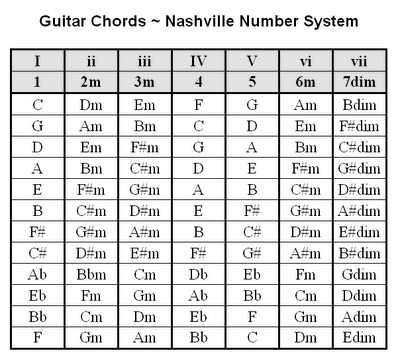

## Midterm Presentation

```{r setup, include=FALSE}
knitr::opts_chunk$set(echo = TRUE)
require(knitr)
source('source.R')
```

### Objective
The objective of this project is to analyze trends in popular music over time. The primary focus will be on analyzing trends in chord progressions across decades in order to test whether or not chord complexity in popular music has changed over time.

### Analytic Sample
For this report, I will be using music from the Hot100 Billboard Chart, which has charted the top 100 songs in popular American music for each week since the late 1950s.  

As a starting point, I decided to create a subset of the data that included the 30 most popular artists from each decade.  I did this because there are so many songs that have made it to the Hot100 over the past 70 years, and I am not sure how many of these songs I will be able to find chord data for. I defined popularity of an artist for a given time period as the number of weeks each artist had a song in the Hot100 within each decade.  The artist would get credit for each song in the Hot100.  Consequently, if in the same week, she had two songs on the list, she would get credit for two weeks.  I chose the number 30 by trial and error.  It seemed through visual inspection that choosing this number would produce a fairly representative list of the most popular artists from each decade.  

```{r Create Subset of Hot100}
read.csv('data/Hot100.csv')

sub_set_num <- 30
hot100 <- read_csv('data/Hot100.csv')


hot100$WeekID <- mdy(hot100$WeekID) 
hot100$Year <- year(hot100$WeekID )

hot100$Decade <-  hot100$Year %>%  
                     str_sub(start= 1L, end = -2) %>%  
                      str_c('0')

hot100_ord <- hot100 %>% 
                  group_by(Decade, Performer) %>% 
                  summarize(n = n()) %>% 
                  arrange(.by_group = TRUE, desc(n) ) 
hot100_split_list <- hot100_ord %>% 
                    split(f = 'Decade')

hot100_sub <- hot100_split_list %>% 
                    lapply(function(x) slice(x, 1:sub_set_num)) %>%
                    bind_rows

#Arrange by Decade in Ascending Order
hot100_sub$Decade <- as.numeric(hot100_sub$Decade )
hot100_sub %>% 
  arrange(Decade)
```

**Issues with Hot100**
*There are certainly issues with using songs based on the Hot100 chart.  One problem is that we will be ignoring trends in music that were influential but may not have reached the list. Essentially, songs that are in the Hot100 most likely do not reflect the full range of musical trends for a given time period.  However, I am unaware of any way to construct a sampling frame of every song recording from the past 70 years from which to sample.  Therefore, the Hot100 can serve as convenient although probably biased sample.  Generally, the projects and studies I have read online have also used the Hot100 as a convenience sample.*


### Scraping Code Data
For the chord data, I will be scraping the data from a site called [Hook Theory](https://www.hooktheory.com/theorytab).  The site allows you to search for chords by song (on the website).

The site has an API, but unlike the actual website, it only allows you to search for songs by their chord progressions.  I have been working on a Webcrawler to search for chord progressions by each artist.

First I searched for available songs by artist.

#### Searching for Avaiable Songs by Artist
```{r Search for Available Songs by Artist}
#Create a vector of artists 
artist <- c('tom petty', 
            'led zeppelin', 'elvis presley', 'ray charles', 'the beatles')

#Create Data.frame of available songs
links <- artist %>%  
  lapply(extract_song_links) %>%  
  bind_rows


#Filter Out Cover Songs
## Watch out for Singers with Different Bands
links <- links[tolower(links$Artist) %in% artist ,]

links

```

#### Web Scraping
Next I had to scrape the chords from the website using the links in the above dataframe.  You may have noticed that I had to scroll down on the [Hook Theory](https://www.hooktheory.com/theorytab)  in order to play "Hey Jude" because the website is dynamic.  Because the website is dynamic and the chords are actually pictures I had to use RSelenium create a webcrawler that scrolls down the page.  This was certainly challenging as I only had experience using rvest for scraping before this semester.  However, rvest cannot scrape images as far as I know.

Note: before using RSelenium you need to download Docker Desktop at 
[Docker Desktop](https://www.docker.com/products/docker-desktop).  Once you set up docker desktop, you need to set up a container from the Terminal using the following code.

  *docker pull selenium/standalone-chrome*
  *docker run -d -p 4445:4444 selenium/standalone-chrome*

You also substitute 'firefox' for chrome if you would like.
You can see the container and its id by running this code.   

  *docker container ls*

When you are finished scraping you can stop the container  by running *docker stop* and then the container id.  You can find the container id by running the *docker container ls* code that I mentioned above. 
  
  *docker stop container_id*

After you set up a container, you can run the code below to scrape the chords.
```{r Scraping , eval=FALSE}

#### Get URLs from dataframe created in previous Chuck
baseURL <- 'http://www.hooktheory.com'
song_urls <- paste0(baseURL, links$Links)


#You need to run this code in Terminal in order to set up a container
###docker pull selenium/standalone-chrome
###docker run -d -p 4445:4444 selenium/standalone-chrome

#Set up Driver 
remDr <- remoteDriver(remoteServerAddr = "localhost",
                      port = 4445L, 
                      browserName = "chrome")
remDr$open()

####Extract Chords ####
df_row_list <- list() #Create Blank List

#Loop through urls
for(i in 1:length(song_urls)){
     
    
      sleep <- 4:10
      sleep_time <- sample(sleep, 1)
      print(paste('Sleep for ', sleep_time, ' seconds...'))
      Sys.sleep(sleep_time)
      #Navigate to Url
   
      remDr$navigate(song_urls[i])
      print(paste('Loading ',remDr$getCurrentUrl()[[1]]))
      #remDr$screenshot(display = T)
      
      #### Extract Song Parts ####
      song_parts <- NA
      names <- remDr$findElements(using="class", value = 'margin-0')
      names <- remDr$findElements(using="css selector", value = "h2")
      namestxt <- sapply(names, function(x) 
                            {x$getElementAttribute("outerHTML")[[1]]})
      song_parts <- extract_song_parts(txt=namestxt)
      song_parts

      ## Scroll down page based on number of song parts;  Allow time to load each part
      if(length(song_parts)==0){
        df_row_list[[i]] <- data.frame(song_parts = NA, chords = NA)
      } else if(length(song_parts) > 0) {
     
        
        #### Scroll to Bottom ####
        scroll_time <- 5
        
        if(length(song_parts)==1){
          remDr$executeScript("window.scrollTo(0,300);")
          sleep_time <- sample(scroll_time , 1)
          print(paste(' Waiting ', sleep_time, ' seconds to load...'))
          Sys.sleep(sleep_time)
          
        } else if(length(song_parts)==2){
          remDr$executeScript("window.scrollTo(0,600);") #Scroll down page
          sleep_time <- sample(scroll_time, 1)     
          print(paste(' Waiting ', sleep_time, ' seconds to load...'))
          Sys.sleep(sleep_time)
          
          
          remDr$executeScript("window.scrollTo(0,900);") #Scroll down page
          sleep_time <- sample(scroll_time, 1)     
          print(paste(' Waiting ', sleep_time, ' seconds to load...'))
          Sys.sleep(sleep_time)

        } else if(length(song_parts) == 3){
          
          remDr$executeScript("window.scrollTo(0,0);") #Scroll down page
          sleep_time <- sample(scroll_time, 1)
          print(paste('Scrolling.  Waiting ', sleep_time, ' seconds to load...'))
          Sys.sleep(sleep_time)
          
          remDr$executeScript("window.scrollTo(0,300);") #Scroll down page
          sleep_time <- sample(scroll_time , 1)
          print(paste('Scrolling.  Waiting ', sleep_time, ' seconds to load...'))
          Sys.sleep(sleep_time)
          
          remDr$executeScript("window.scrollTo(0,600);") #Scroll down page
          sleep_time <- sample(scroll_time , 1)
          print(paste('Scrolling.  Waiting ', sleep_time, ' seconds to load...'))
          Sys.sleep(sleep_time)
        
          remDr$executeScript("window.scrollTo(0,900);") #Scroll down page
          sleep_time <- sample(scroll_time, 1)
          print(paste('Scrolling.  Waiting ', sleep_time, ' seconds to load...'))
          Sys.sleep(sleep_time)
          
          
        }else if(length(song_parts) >= 4){
          
          remDr$executeScript("window.scrollTo(0,0);") #Scroll down page
          sleep_time <- sample(scroll_time, 1)
          print(paste('Scrolling.  Waiting ', sleep_time, ' seconds to load...'))
          Sys.sleep(sleep_time)
          
          remDr$executeScript("window.scrollTo(0,300);") #Scroll down page
          sleep_time <- sample(scroll_time, 1)
          print(paste('Scrolling.  Waiting ', sleep_time, ' seconds to load...'))
          Sys.sleep(sleep_time)
          
          remDr$executeScript("window.scrollTo(0,600);") #Scroll down page
          sleep_time <- sample(scroll_time, 1)
          print(paste('Scrolling.  Waiting ', sleep_time, ' seconds to load...'))
          Sys.sleep(sleep_time)
          
          remDr$executeScript("window.scrollTo(0,900);") #Scroll down page
          sleep_time <- sample(scroll_time, 1)
          print(paste('Scrolling.  Waiting ', sleep_time, ' seconds to load...'))
          Sys.sleep(sleep_time)
          
          remDr$executeScript("window.scrollTo(0,1200);") #Scroll down page
          sleep_time <- sample(scroll_time, 1)
          print(paste('Scrolling.  Waiting ', sleep_time, ' seconds to load...'))
          Sys.sleep(sleep_time)
        }

        elem <-  elemtxt <- elemxml<- idx <- NA
        elem <- remDr$findElement("css", "body")
        elemtxt <- elem$getElementAttribute("outerHTML")[[1]]
        elemxml <- htmlTreeParse(elemtxt, useInternalNodes=T)
        
        #Create Xpaths
        idx <- 1:length(song_parts)*3
        xpath <- paste0('(//svg)[', idx, ']//tspan[@alignment-baseline]',
                         '|(//svg)[', idx, ']//tspan[@baseline-shift]')
        
        #Create Empty Vectors to store Xpaths and chords
        chords <- rep(NA, length(song_parts))
        x <- NA
     
        for(j in 1:length(chords)){
   
          x <- xpathApply(elemxml, xpath[j])  
          
          chord_string <- character()
          chord_string <- sapply(x,xmlValue) %>% 
                              paste(sep = '', collapse = ' ') %>%
                              clean_song_contents %>% 
                              str_split(pattern = ' ') %>% 
                              unlist
          
          chord_string <- chord_string[chord_string != '']
          chord_string <- remove_dup_seqs(chord_string)
          chord_string <- paste(chord_string, collapse = '-')
          chords[j] <-  chord_string 
          
        }
        
        #Store info as dataframe; Then assign dataframe to list
        df_row_list[[i]] <- data.frame(artist = links$Artist[i], 
                                       song = links$Songs[i], 
                                       song_parts,
                                       chords,
                                       link = song_urls[i])
    }

}

#Bind list into single dataframe
chords_df <- df_row_list %>%  
  compact %>% 
  lapply(function(x) mutate_all(x, as.character)) %>% 
  bind_rows 

```


### Subset of the Data 
Here is a sample of songs that I was able to scrape. You can see that the data.frame below includes a row for each part from each song.  The columns include the artist, song, song part, hooktheory link, and most importantly the chords. 

```{r Subset of Chord Data}
sample_songs <- read.csv('data/sample_data_frame.csv')
sample_songs <- sample_songs %>%  select(-X)
sample_songs
```

#### Errors###
Here are a list of the some of the errors I encountered while scraping.  I very much would appreciate any feedback I could get on how I can get the crawler to stop crashing.  

*Selenium message:unknown error: session deleted because of page crash from unknown error: cannot determine loading statusfrom tab crashed*
*(Session info: chrome=72.0.3626.121) (Driver info: chromedriver=2.46.628388 (4a34a70827ac54148e092aafb70504c4ea7ae926),platform=Linux 4.9.125-linuxkit x86_64)*

*Error: 	 Summary: UnknownError*
*Detail: An unknown server-side error occurred while processing the command.*
*Further Details: run errorDetails method*


#### Roman Numerical Analysis
There is a way to transcribe music referring to the scale degree of each chord within each key.  You may have noticed from looking at  [Hook Theory](https://www.hooktheory.com/theorytab) that there were roman numerals above the letter names for each chord.  For Hey Jude, there is a roman numeral *I* above the *F* chords because F is the first chord in the key of F major.  There is a *V* above the C because C is the fifth note in F major ( F-G-A-Bb-C) .  

On the other hand, [Let it Be](https://www.hooktheory.com/theorytab/view/the-beatles/let-it-be) is written in the key of C major.  Therefore, *C* is now *I* and *G* is now *V* (C-D-E)

As you can see converting chord progressions to roman numerical analysis is very easy as long as you know the key of a song and the chords in each key.
You can see the chord conversion below for all the major keys.



Converting chords to numerical analysis is important because we need to recognize that a progression from *C* to *G* is equivalent to *F* to *C*.  They would both be written as *I-V* in roman numerical analysis. In fact, musicians will often *transpose* songs using roman numerical analysis.  This means that they play equivalent chord progressions in different keys. Musicians generally transpose music when certain notes in a song fall out of a singer's range. 

### Why Don't I scrape Roman Numerals from Hooktheory
Unfortunately, I haven't been able to figure out how to scrape the Roman Numerals directly from the website.  However, converting the chords into Roman Numerical Analysis will not be difficult as long as I have the correct song key. 

### Extracting Song Key
I have created a function to extract the song key based on the first chord in each progression.  Typically, the first chord in a progression is indicative of the key that the song is written in, especially in popular music.  However, this is not always the case.  Hooktheory does include the key on each page, so one of my next steps is to edit the web crawler to extract the song key as well.  However, this is function will serve a reasonable backup since it will almost always predict the correct key.

```{r Extract Song Keys}
d <-sample_songs

d <- d %>%  mutate(artist_song = paste(artist, song, sep = "_"))
d$artist <- as.character(d$artist)
d$song <- as.character(d$song)

d_list <- split(d, d$artist_song) 

d_keys <- d_list %>% lapply(extract_song_key) %>%  unlist

key_df <-str_split(names(d_keys), "_") %>%  bind_cols %>% t  %>% as.data.frame
rownames(key_df) <- NULL
colnames(key_df) <- c('artist', 'song')
key_df$keys <- d_keys 
key_df$artist <- as.character(key_df$artist)
key_df$song <- as.character(key_df$song)

final_df <- d %>%  
  left_join(key_df, by = c('artist', 'song')) %>% 
  select(-artist_song)
final_df %>% select(- link)

```


#### Merging Data with Info from Spotify
I have also worked on merging this data from info obtained from the Spotify API. Spotify includes information on tempo, loudness, and song duration as well.

However, I am still undecided if I will use this info in my final analysis based on the difficulty of linking songs and artists whose names are often written differently.  In addition, the song features may not be directly relevant to my research question.  Nevertheless, I found it useful as a preliminary step for assessing possible features for my dataset.

*NOTE: To work with the Spotify API, you'll have to set up an account to get an access token*

[Set up Spotify Account](https://developer.spotify.com/dashboard/)

#### Working with Spotify API
```{r Spotify API}

#Get Artist Tracks
tom_petty_tracks <- get_artist_tracks(artist_name ='Tom Petty', token = my_token)
elvis_tracks <- get_artist_tracks(artist_name ='Elvis Presley', token = my_token)
ray_tracks <- get_artist_tracks(artist_name ='Ray Charles', token = my_token)
zeppelin_tracks <- get_artist_tracks(artist_name ='Led Zeppelin', token = my_token)
beatles_tracks <- get_artist_tracks(artist_name ='The Beatles', token = my_token)

#Bind tracks with audiofeatures
ray_track_info <- ray_tracks %>% 
                  cbind(get_track_audio_features(tracks=ray_tracks, access_token = my_token))
elvis_track_info <- elvis_tracks %>% 
                    cbind(get_track_audio_features(elvis_tracks, access_token = my_token))
tom_petty_track_info <-tom_petty_tracks %>% 
                         cbind(get_track_audio_features(tom_petty_tracks, access_token = my_token))
zeppelin_track_info <- zeppelin_tracks %>% 
                        cbind(get_track_audio_features(zeppelin_tracks, access_token = my_token))
beatles_track_info <- beatles_tracks %>% 
                      cbind(get_track_audio_features(beatles_tracks, access_token = my_token))

#Bind Track Info Dfs Together
track_info <- rbind(ray_track_info,
                    elvis_track_info,
                    tom_petty_track_info,
                    zeppelin_track_info,
                    beatles_track_info)

#Remove Remastered and Recording info from Track Name
track_info$track_name <- track_info$track_name %>%  
  str_remove_all(' - .*') 

track_info <- track_info[, -grep('track_uri', names(track_info))[2]]

##### Merge Spotify Data with Sample Data Frame ####

sample_artists <- read.csv('data/sample_data_frame.csv')
sample_artists <- sample_artists %>%  
                        mutate_all(as.character) %>% 
                        select(-X)
sample_artists$artist
sample_artists  <- sample_artists %>% 
                      mutate(song = if_else(song == 'Georgia',
                                            'Georgia On My Mind', song))
sample_artists  <- sample_artists %>% filter(chords != "")
sample_artists[grepl('Tom Petty and|Tom Petty And', sample_artists$artist) ,  'artist'] <- 'Tom Petty'
       

d <-sample_artists %>% 
       mutate(song_id = tolower(song)) %>% 
       left_join(track_info %>% mutate(track_name = tolower(track_name)),
            by =c('artist', 'song_id' = 'track_name')) %>% 
       distinct(artist, song, song_parts, .keep_all = T) %>% 
       select(-song_id)
d
```


*In the next section, I will go over my next steps as well as the challenges I will face going forward.*

#### Next Steps
1) Edit webcrawler to include song key data.
2) Create a Function to convert chords to roman numerical analysis.
3) Create a list of features.  I was thinking of creating bigrams and trigrams based on the roman numerical analysis for each song part.  I was also thinking of including binary variable if a song contains a certain chord type such as a 7th, diminished, maj 7th, min 7th, etc.  These features could be proxies for chord complexities.
4) Find a way to keep the webcrawler from crashing 

#### Where I Need Support: Technical Areas 
1) Getting the webscraper to scrape chords with out crashing the page.  There may be some issues with docker as well because I have been programming a lot of time between each query.  
2) Linking songs to genre and other features the Spotify API or another database.  Songs are often written differently.  Sometimes song titles are abbreviated and other times extra lyrics are added.  For example, Hooktheory.com listed "Georgia on My Mind" simply as  "Georgia", so I needed to convert it in order to link it to info from the Spotify API.  

#### Theoretical Areas that May be of Concern
1) Hooktheory.com does not have as many songs from earlier decades as it does from recent music.
2) The number of chords in music are much smaller than the number of words in a given language, so borrowing methods from text analysis may not work.