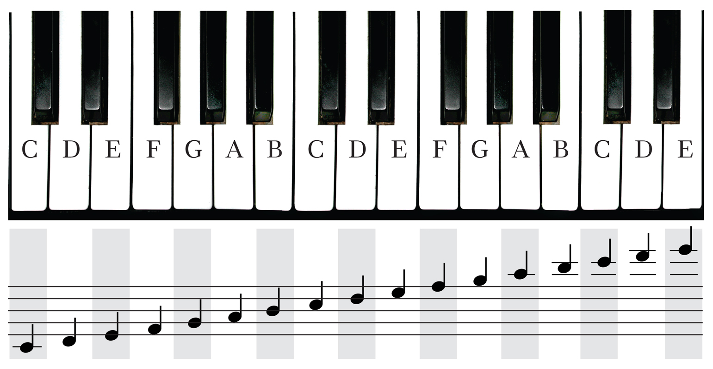

```{r setup, include=FALSE}
knitr::opts_chunk$set(echo = TRUE,
                      fig.pos='H')
library(knitr)

```

## Basic Music Theory 
I think my project is difficult to understand unless you have a basic understanding of music theor. 

I have never taken a formal music theory course, but I have gained a basic understanding through my guitar teachers over the years. 

I'm going to summarize the basic the concepts as I understand them.  I may be missing some nuances, and I would like any feedback if I have misrepresented anything.  However, for my 


## Octave
Lets start with an octave.  

Starting at C, we have the following notes.

C-C#-D-D#-E-F-F#-G-G#-A-A#-B-C

This is the chromatic scale, which has 12 notes.  Notice that at the 13th note, C, the names of the notes begin repeating.

Here the intervals are considered *half steps*.  To construct a major scale we take two *full steps*, one half step, then three more full steps, and finally one more half step.  A full step is simply two half steps. 

So the notes in C major are:

C (whole step) D (whole step) E (half step) F (whole step) G (whole step) A
(whole step) B (half step) C.

Notice that when when we took a whole step, we skipped a note in the chromatic step.  So we skip C# and go to D, then skip D# and go to E.  However, when we take a half step we include the next note so we do not skip over F.

The C-major scale corresponds to the white keys on a keyboard.

```{r  out.width = "50%"}
 
```


## Scale
Next let's look at scales.  The most common scales in music

In the song Do-Re-Mi from the Sound of Music, the main character, Maria, teaches the C-major scale to 

[Blues Progression](https://www.google.com/search?ei=I5mGXKuRF8-4ggfHkJfYBA&q=sound+of+music+do+re+mi+&oq=sound+of+music+do+re+mi+&gs_l=psy-ab.3..0l10.95.2896..3438...4.0..0.339.3461.2-9j3......0....1..gws-wiz.......0i10j33i299j0i22i30j0i13.AXYGzu4FoVQ)

Do-Re-Mi-Fa-So-La-Ti are simply note names corresponding to C through B. Notice that in the song, she cycles through the entire scale until she gets to 'Do' again, which is the same note, but an octave higher.  


## Chords

We can build a major chord by taking the first, third, and fifth notes from each scale.

For example,
The notes in C major are C-D-E-F-G-A-B
So the notes in a Cmaj chord are C E G.  
The notes D E F# G A B C# D 
In minor chords 

*Note: If a chord is written as C or D we can assume it is a major chord.  Also, sometimes people write C- or D- for minor chords instead of using 'min' or 'mi'.*

## Chord Progression
Using the notes of each scale, we can construct chords that go well together.  For example, here are the chords in the C major scale. 

Cmaj-Dmi-Emi-Fmaj-Gmaj (or G7)-Amin-Bdim (or Bm7 $\flat$ 5)

We can represent any chord with its position in the scale.  For example, we can represent Dmi as ii and Fmaj as IV.  The convention is to use lower case roman numerals for minor chords and upper case for major chords.  

Using this notation, we can represent the same progression in different keys.

### Example: 12 Bar Blues Progression (I-IV-V)
[link](https://www.pianolessons.com/piano-lessons/12-bar-blues.php)

In the video, the blues progression uses the chords G, C, and D in the following pattern. 

G-G-G-G-C-C-G-G-D-C-G

I've repeated the chords to represent each measure (or bar).  A measure in most songs in Western music consists of 4 beats.  Notice that there are 12 measures (or bars) in the pattern hence the name 12-bar blues.  

G can represented by I, C by IV, and D by V. *Think in the G-major scale (G-A-B-C-D-E-F#-G), G is the first note, C is the fourth note, and D is the fifth note*. We can convert this I-I-I-I-IV-IV-I-I-V-IV-I or simply I-IV-I-IV-V-IV-I ignoring the number of measures.  

The same chord progression could be played in Emaj using E for I, A for IV, and B for V.  This is because in the Emajor scale (E-F#-G#-A-B-C#-D#-E), E is the first note, A is the fourth note, and B is the fifth note. Consequently, using the numerical form is the same for the same progression regardless of the key. 

In fact, we can use the roman numerical representing to *transpose* the same chord progression into any key.  Musicians often transpose songs when there are notes that are out of range of a singer.  The singer and musicians can play the same sequence of chords/notes, just in a different key.  

## My Project 


## References

[link](https://www.musicradar.com/how-to/music-theory-primer-understanding-notes-intervals-scales-and-chords)


